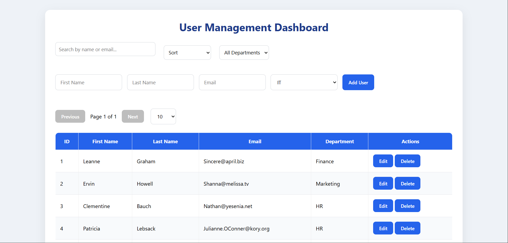
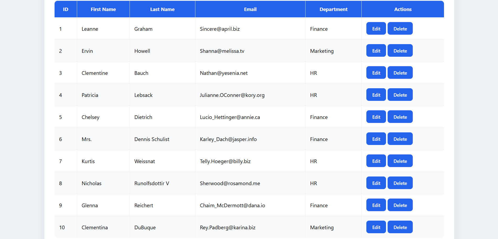

# User Management Dashboard

A responsive User Management Dashboard built using **React**, **Vite**, and **Axios**. This application interacts with the JSONPlaceholder REST API to demonstrate CRUD operations, along with search, sort, filter, and pagination.

---

## Features

- View users from JSONPlaceholder API
- Add a new user
- Edit existing user details
- Delete a user
- Search users by first name, last name, email, or department
- Sort users by first name (A-Z / Z-A)
- Filter users by department
- Pagination with page size options (10, 25, 50, 100)
- Responsive UI
- Client-side form validation
- Error handling for API requests

---

## Technologies Used

- React
- Vite
- Axios
- JavaScript (ES6)
- CSS3

---

## Project Structure

```
src/
│── components/
│   ├── UserForm.jsx
│   ├── UserTable.jsx
│   ├── SearchBar.jsx
│   ├── FilterPopup.jsx
│   └── Pagination.jsx
│
│── services/
│   └── api.js
│
│── App.jsx
│── App.css
│── index.css
│── main.jsx
```

---

## Installation

Clone the repository:

```bash
git clone <your-github-repository-url>
```

Navigate to the project folder:

```bash
cd user-management-dashboard
```

Install dependencies:

```bash
npm install
```

Run the development server:

```bash
npm run dev
```

Open your browser and visit:

```
http://localhost:5173
```

---

## API Used

JSONPlaceholder

```
https://jsonplaceholder.typicode.com/users
```

---

## Assumptions

- JSONPlaceholder simulates POST, PUT, and DELETE requests but does not permanently save changes.
- New, updated, and deleted users are reflected in the application's local state to simulate real CRUD functionality.

---

## Challenges Faced

- JSONPlaceholder does not persist data after POST, PUT, and DELETE requests.
- The API returns only 10 users, so pagination with 25, 50, and 100 page sizes cannot display additional records unless users are added locally.
- The API provides a single `name` field, so it was split into `firstName` and `lastName`.
- The API does not include a `department` field, so departments were assigned locally for demonstration.

---

## Future Improvements

- Integrate a real backend with persistent storage.
- Add authentication and user roles.
- Implement a filter modal instead of a dropdown.
- Add unit and integration tests.
- Improve UI with a component library such as Material UI.

---


---

## Screenshots






## Author

**Likhitha NK**